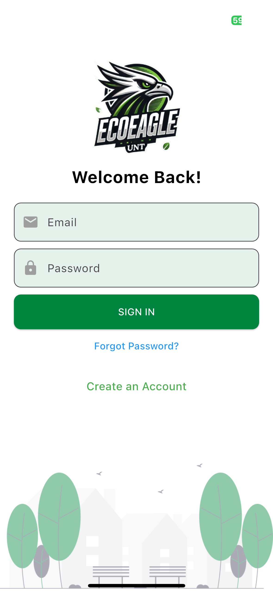
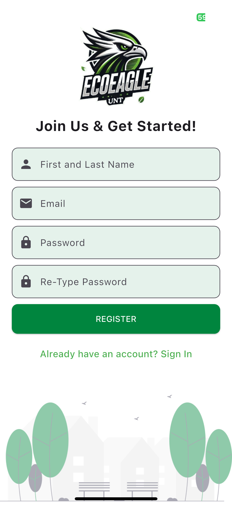
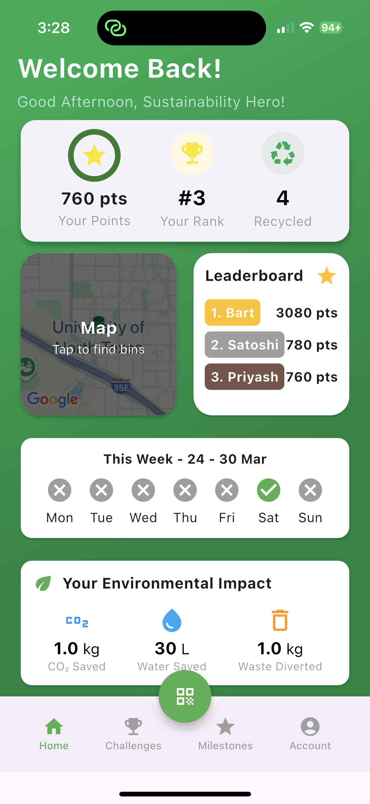
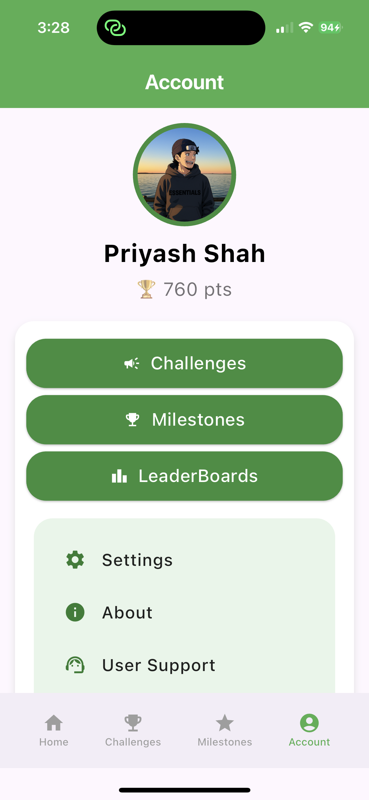
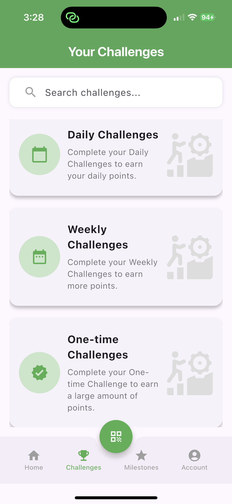
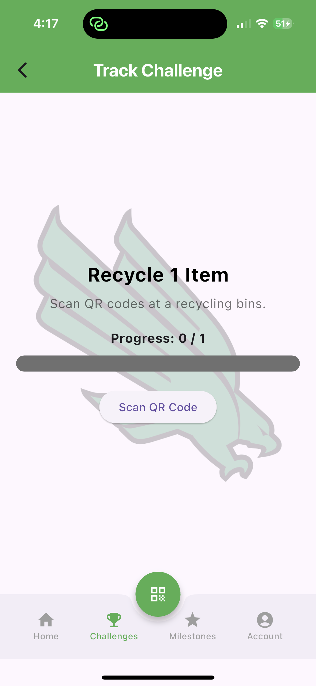
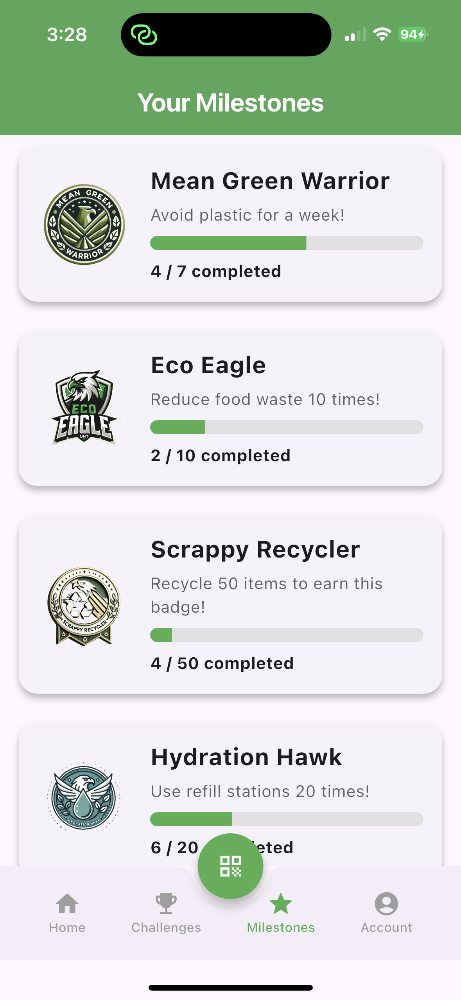
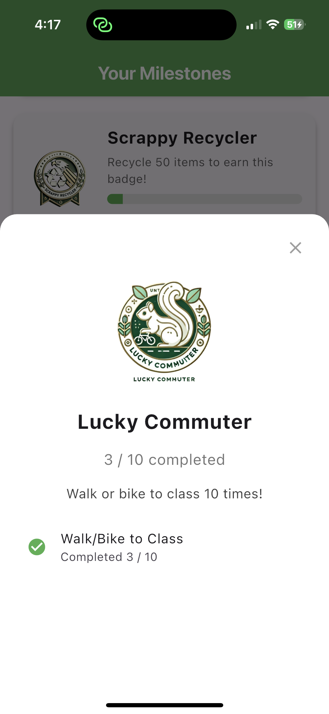
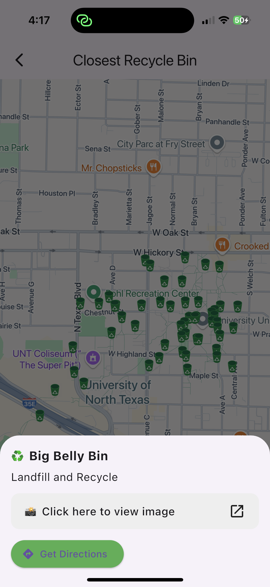
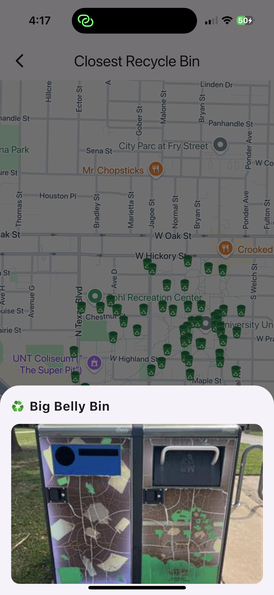

# EcoEagle – Sustainability Tracker

EcoEagle is a Flutter-based mobile app designed to empower students at the University of North Texas (UNT) to engage in sustainable practices through gamified challenges, QR code tracking, and a real-time leaderboard.

The app makes sustainability fun, rewarding, and community-driven — helping students track eco-friendly actions and earn points, badges, and recognition.

---

## Download the App

EcoEagle is now available on the App Store and Google Play. Download and start making an impact today:

- [Download on the App Store](https://apps.apple.com/app/idYOUR_APP_ID)
- [Get it on Google Play](https://play.google.com/store/apps/details?id=YOUR_PACKAGE_NAME)

---

## Features

### 1. QR Code Integration
- Scan QR codes at recycling bins, refill stations, and other eco-zones around campus to log sustainable actions.  
- Each scan is recorded in real time and contributes toward personal and team-based achievements.

### 2. Sustainability Challenges
Engage in a variety of interactive challenges categorized as:
- **Daily Challenges** (e.g., Go Plastic-Free Today)
- **Weekly Challenges** (e.g., Bike to Class 5 Times)
- **One-Time Milestones** (e.g., Attend a Tree Planting Event)

All challenge progress is tracked and synced with Firebase Firestore.

### 3. Progress & Badge System
Earn points and unlock custom UNT-themed digital badges:

| Badge Name               | Requirement                     |
|--------------------------|---------------------------------|
| Scrappy Recycler         | Recycle 50 items                |
| Mean Green Warrior       | Go Plastic Free For A Week      |
| Hydration Hawk           | Use Refill Station 20 times     |
| Lucky Commuter           | Walk or Bike to Campus          |
| Eco Eagle                | Reduce Food Wastes 10 Times     |
| Umtimate Mean Green Hero | Collect all of the Above Badges |

Track progress with visual indicators, unlock milestones, and show off your badges on your profile.

### QR Code Preview

|  |  |
|--------------------------------------|----------------------------------------|

> These QR codes are placed on campus at UNT recycling and refill stations. Scanning them logs your activity and boosts your sustainability score.


### 4. Leaderboard and Recognition
Compete individually or as part of a team (clubs, departments, or dorm groups).  

Top performers may be featured in UNT Sustainability social media campaigns and events.

### 5. Community Engagement
- Participate in monthly competitions and team challenges
- Share your sustainability efforts with friends
- Stay motivated with weekly push notifications about your rankings

---

## Screenshots

### Login & Dashboard Views

| Login                                  | Registration                             | Home Dashboard                          | Account                             |
|----------------------------------------|------------------------------------------|------------------------------------------|-------------------------------------|
|         |      |  |  |


### Features: Challenges, Milestones & Map

| Challenge Details                                                                 | Milestone Badges                                                                   | Map Views                                    |
|-----------------------------------------------------------------------------------|-------------------------------------------------------------------------------------|----------------------------------------------|
| <br> | <br> | <br> |

---

## Built With

- **Flutter** – Cross-platform mobile framework
- **Firebase** – Authentication, Firestore, Cloud Functions, and Storage
- **Google Maps API** – For bin/station location mapping
- **Confetti + Animations** – Celebrate milestone completions

---

## Setup Instructions

1. Clone the repository:
   ```bash
   git clone https://github.com/samipx16/Capstone-II.git
   ```
2. Navigate to the project directory:
   ```bash
   cd ecoeagle
   ```
3. Install dependencies:
   ```bash
   flutter pub get
   ```
4. Run the app:
   ```bash
   flutter run
   ```

Make sure you have Firebase set up for Android and iOS with the appropriate configuration files (`google-services.json` and `GoogleService-Info.plist`).

---

## App Icon & Branding

EcoEagle features a custom app icon and branding inspired by UNT’s school spirit.  
To customize your app icon, ensure your image is properly formatted (1024x1024 PNG) and configured in `pubspec.yaml` under `flutter_launcher_icons`.

---

## Contributing

We welcome contributions from the UNT community and beyond. If you’re interested in sustainability, tech, or design, feel free to fork this repo and submit a pull request.

---

## License

This project is licensed under the MIT License. See the `LICENSE` file for details.

---